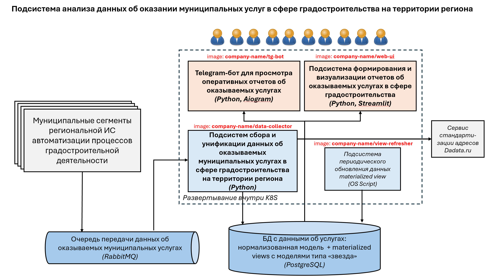

## Развертывание ИС в Kubernetes
Репозиторий содержит yaml-манифесты с описанием элементов для развертывания в Kubernetes предполагаемых компонент 
информационной подсистемы анализа данных об оказании муниципальных услуг в сфере градостроительства на территории 
региона (далее - Подсистема)

### Общее описание Подсистемы
На рисунке ниже представлены основные компоненты Подсистемы. Данные об оказываемых муниципальных услугах порождаются 
в __муниципальных сегментах__ большой региональной ИС. По мере появления данных, они размещают сообщения c данными в 
__очередь__, находящуюся под управлением брокера сообщений RabbitMQ. 

Обработкой этих данных в составе Подсистемы занимается __подсистема сбора и унификации данных__, реализованная на Python 
и отвечающая за получение данных из _очереди_, проверку их корректности (включая проверку указанных в них адресов 
объектов на территории с помощью внешнего сервиса стандартизации адресов dadata) и сохранение их в единую _аналитическую 
БД_ под управлением PostgreSQL. 
__Аналитическая БД__ состоит из двух частей. Одна - хранит все данные в рамках нормализованной реляционной модели,
а вторая - содержит материализованные представления, структура которых построены по модели "звезда", используемой 
в OLAP-системах.
За периодическое обновление данных в материализованных представлениях отвечает __подсистема обновления__, которая
по заданному расписанию подключается к БД и выполняет запрос по обновлению представлений. 

