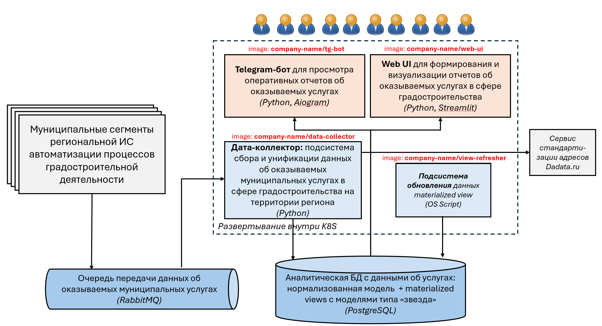

## Развертывание ИС в Kubernetes
Репозиторий содержит yaml-манифесты с описанием элементов для развертывания в Kubernetes предполагаемых компонент 
информационной подсистемы анализа данных об оказании муниципальных услуг в сфере градостроительства на территории 
региона (далее - Подсистема)

### Общее описание подсистемы
На рисунке ниже представлены основные компоненты Подсистемы. Данные об оказываемых муниципальных услугах порождаются 
в __муниципальных сегментах__ большой региональной ИС. По мере появления данных, они размещают сообщения c данными в 
__очередь__, находящуюся под управлением брокера сообщений RabbitMQ. 



Обработкой этих данных в составе Подсистемы занимается __дата-коллектор__ - подсистема сбора и унификации данных, 
реализованная на Python 
и отвечающая за получение данных из _очереди_, проверку их корректности (включая проверку указанных в них адресов 
объектов на территории с помощью внешнего сервиса стандартизации адресов dadata) и сохранение их в единую _аналитическую 
БД_ под управлением PostgreSQL. 

__Аналитическая БД__ состоит из двух частей. Одна - хранит все данные в рамках нормализованной реляционной модели,
а вторая - содержит материализованные представления, структура которых построены по модели "звезда", используемой 
в OLAP-системах.

За периодическое обновление данных в материализованных представлениях отвечает __подсистема обновления__, которая
по заданному расписанию подключается к БД и выполняет запрос по обновлению представлений.

Для взаимодействия с пользователями Подсистема содержит __Telegram-бот__, позволяющий непосредственно в мессенджере 
получать наиболее часто используемые отчеты о процессах оказания услуг на территории, а также __Web-интерфейс__, 
позволяющий строить более полный набор отчетов и визуализаций, и анализировать имеющиеся данные в различных срезах.

### Размещение компонент подсистемы в Kubernetes-кластере
Для размещения компонент подсистема в Kubernetes-кластере используются следующие файлы манифестов: 
- [data-collector.yaml](system-deployment-configuration/data-collector.yaml) - deployment для развертывания docker-образа
```company-name/data-collector``` c _дата-коллектором_;
- [view_refresher.yaml](system-deployment-configuration/view_refresher.yaml) - deployment для развертывания docker-образа
```company-name/view_refresher``` c _подсистемой обновления_;
- [tg-bot.yaml](system-deployment-configuration/tg-bot.yaml) - deployment для развертывания docker-образа
```company-name/tg-bot``` c _телеграм-ботом_;
- [web-ui.yaml](system-deployment-configuration/web-ui.yaml) - deployment для развертывания docker-образа
```company-name/web-ui``` c _Web UI_;
- [sys-config-params.yaml](system-deployment-configuration/sys-config-params.yaml) - configMap с параметрами
подключения к PostgreSQL и RabbitMQ;
- [sys-secrets.yaml](system-deployment-configuration/sys-secrets.yaml) - secret с логинами, паролями для подключения 
к PostgreSQL и RabbitMQ, а также токены для подключения к API dadata и Telegram;
- [web-ui-service.yaml](system-deployment-configuration/web-ui-service.yaml) и 
[web-ui-ingress.yaml](system-deployment-configuration/web-ui-ingress.yaml) - service и ingress для организации 
доступа пользователей к Web UI из сети Интернет;


### Размещение внешних компонент
Муниципальные сегменты размещены на трех серверах под управлением ОС Windows Server и имеющих следующие параметры:
- сервер 1: 80Гб ОЗУ, 4ТБ HDD, 32 ядра СPU;
- сервер 2: 32Гб ОЗУ, 1ТБ HDD, 16 ядер СPU;
- сервер 3: 64Гб ОЗУ, 3ТБ HDD, 32 ядер СPU;

RabbitMQ и PostgreSQL также размещены на сервере 1 и запущены на стандартных для этих программ портах.

Сервис Dadata доступе по адресу https://dadata.ru


